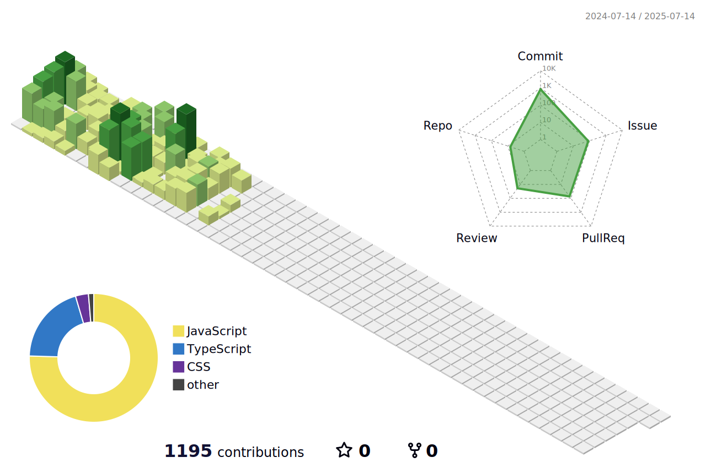

## 🚀 기술 및 도구

### 프론트엔드 개발

### 프로그래밍 언어

### 스타일링

### 도구 및 플랫폼

### 기타

---

### 🖼️ 3D 기여 캘린더

---

제 프로필을 방문해 주셔서 감사합니다! 프로젝트 협업이나 간단한 인사도 언제든 환영합니다. 😊

notion : <https://lcodekr.notion.site/Study-91c5c44563794fcabe35c1bf71394f77>

<!--
**leeheejaelcode/leeheejaelcode** is a ✨ _special_ ✨ repository because its `README.md` (this file) appears on your GitHub profile.

Here are some ideas to get you started:

- 🔭 I’m currently working on ...
- 🌱 I’m currently learning ...
- 👯 I’m looking to collaborate on ...
- 🤔 I’m looking for help with ...
- 💬 Ask me about ...
- 📫 How to reach me: ...
- 😄 Pronouns: ...
- ⚡ Fun fact: ...
-->
